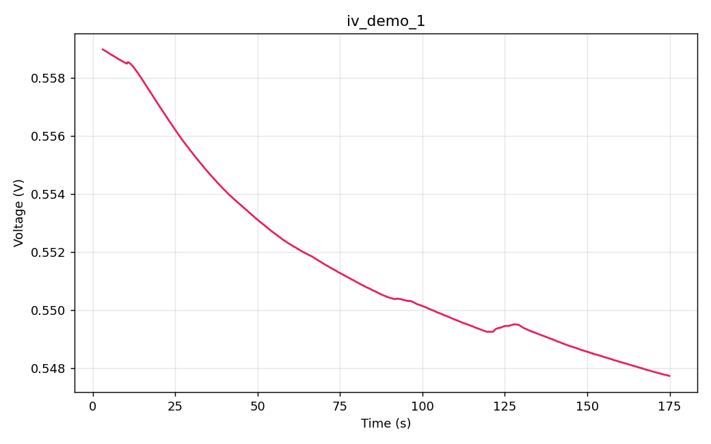
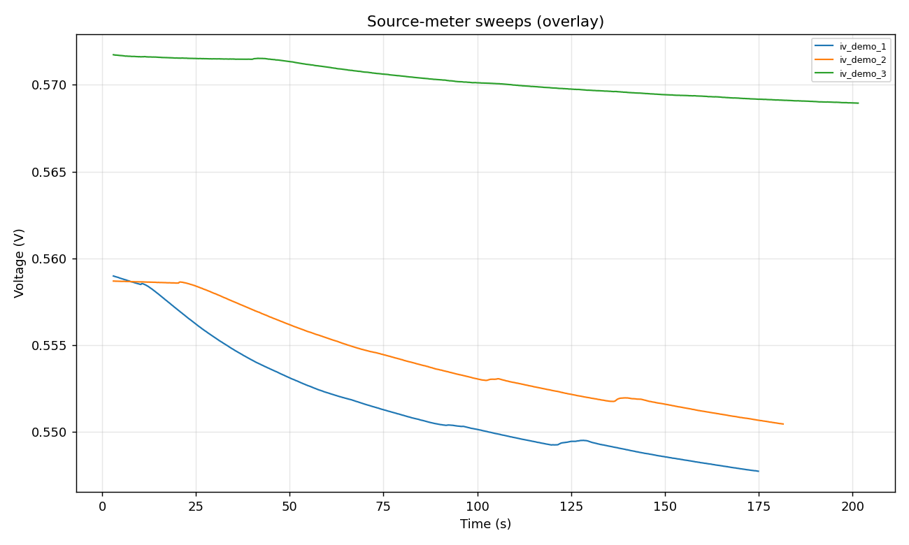

# ivex

Convert proprietary Keysight B2900-series Source/Measure Unit `.QIVD` binary files to plain CSV (and quick-look PNG plots) on any PC, without the original B291x Utility Software.

| Single sweep (`.QIVD`) | Overlay of three sweeps |
|:---:|:---:|
|  |  |
| Voltage relaxation under gas exposure at constant-current bias | Three runs on the same sample, overlaid |

## The problem this solves

The Keysight B2900-series SMUs save data in their own `.QIVD` binary format by default. The instrument software, **B291x Utility Software** ("Quick I-V"), offers a checkbox to also export a plain CSV file at save time. If that checkbox stays unticked, the resulting `.QIVD` files cannot be opened by anything else on your laptop.

The usual workaround is to physically go back to the instrument PC, open each file one at a time in B291x Utility, and use its "Save As CSV" command. This becomes painful when the instrument PC is busy, in another room, or running a Windows version you would rather not touch.

This script reads those binary files directly, on any PC. Point it at your own laptop, a shared drive, or an old archive of measurements and it converts the whole tree in one pass.

## Background

The instrument this targets:

- **Keysight B2900-series Precision Source/Measure Unit** (B2901, B2902, B2911, B2912 and equivalents). Writes `.QIVD` files. Controlled by *B291x Utility Software*.

About the original software:

- Name on disk: **QuickIV** (B291x Utility Software). Product name in version info is just "Quick IV".
- Version verified against: **4.2.2045.2760** (installer build 2017-07-27, signed by Keysight Technologies; in-program copyright 2011-2016).
- Architecture: 32-bit Windows **.NET / WPF** application. The two libraries that own measurement persistence are `SamplingLib.dll` (sampling mode) and `SweepLib.dll` (sweep mode). The file-format magic and the deserialization error strings live in `TestMain.dll`. Plotting inside the program is done with OxyPlot. The installer is a 76 MB InstallShield wrapper (`QuickIV-4-2-2045-2760.EXE`).
- Hard dependency: **Keysight IO Libraries Suite** (provides the VISA drivers; the installer for this is a separate ~260 MB package). Without it, QuickIV cannot talk to the instrument.
- Distribution: not available as a public download. The only ways to get the installer are through a Keysight support request or from another lab that already has it.

Two file extensions exist:

- `.qivd` is the **Quick IV Data File** (measurement results). This is what ivex converts.
- `.qivm` is the **Quick IV Setting File** (a saved test recipe: source mode, ranges, compliance, sample count, timing). It does not contain measurement data and is out of scope for ivex.

What `.qivm` files look like internally (from a spot-check of 13 files in the test archive):

- Same magic header as `.qivd`, same overall TLV structure.
- A fixed file size of 9364 bytes across every `.qivm` sampled. The schema is rigidly fixed: the same parameter slots are present in every file, with values written in place.
- The tag-7 "data" records inside the column blocks have a length of zero (no captured samples).
- Plaintext fields readable directly: VISA address and serial of the configured instrument, the test mode (`Sampling`, `Sweepd`, or `Source & Sampling`), and the channel names registered for the test.
- The acquisition parameters themselves (source level, compliance, ranges, sample count, timing) are stored as a fixed-index parameter table with no field names embedded in the binary. The index-to-label mapping lives inside `TestMain.dll`'s deserialization code. Extracting it would require decompiling that DLL with a .NET decompiler such as ILSpy or dnSpy. That work has not been done here.

The `.QIVD` format is not publicly documented. The only built-in way to get data out is the program's "Save As CSV" command, one file at a time.

This tool reverse-engineers the format and converts a whole tree of files in one pass.

## What it does

Pointed at a folder, `ivex.py`:

1. Recursively finds every `.QIVD` file under it.
2. For each file:
   - Parses the binary header (instrument VISA address, column metadata).
   - Extracts every channel that was recorded: voltage, current, resistance, power, time, and state.
   - Writes a CSV next to the original (same base name, `.csv` extension).
   - Writes a single-sweep PNG next to it. The plot picks whichever of voltage or current is the measured channel by checking which one is actually varying. The other channel is being sourced and held constant, and plotting it would just show ADC noise.
3. Generates an overlay PNG in a `plots/` folder showing every sweep on one axis for quick cross-sample comparison.
4. Logs everything to `ivex.log` in the root.

## Quick start

Requirements: Python 3.8+ and `matplotlib`.

```bash
pip install matplotlib
```

Drop `ivex.py` into the folder containing your data (subdirectories are walked automatically), then:

```bash
python ivex.py
```

Or point it at a specific folder:

```bash
python ivex.py "C:/path/to/data"
```

The repository includes a `samples/` folder with three `.QIVD` files, plus the original Keysight CSV exports (as `.qivd.csv`) for two of them, so you can compare against ground truth out of the box:

```bash
python ivex.py samples
```

Output looks like:

```
OK   iv_demo_1.qivd: 1720 pts x 6 cols -> iv_demo_1.csv
OK   iv_demo_2.qivd: 1786 pts x 6 cols -> iv_demo_2.csv
OK   iv_demo_3.qivd: 1986 pts x 6 cols -> iv_demo_3.csv
  -> plots/_overlay.png

Done. 3 succeeded, 0 failed. Log: ivex.log
```

Re-running the script regenerates everything. CSV and PNG outputs can be deleted at any time and rebuilt on the next run.

## Output format

Each CSV has a short comment header followed by the data:

```
# Source: Keysight B291x SMU (B291x Utility Software .qivd)
# Sample: iv_demo_1
# Instrument VISA: USB0::2391::52504::MY00000000::0::INSTR
# Points: 1720
# Sample step: 0.1 s    Duration: 171.9 s
# Columns: CH1 Voltage, CH1 Current, CH1 Resistance, CH1 Power, CH1 Time, CH1 State
voltage_V,current_A,resistance_ohm,power_W,time_s,state
0.558983,0.1,5.58983,0.0558983,3,4230
0.558977,0.1,5.58977,0.0558977,3.1,4230
0.558972,0.1,5.58972,0.0558972,3.2,4230
...
```

All six channels are emitted whenever they are present in the binary, regardless of which columns the user happened to tick in B291x Utility's CSV export dialog. The binary always stores everything.

## Accuracy

Verified against 17 ground-truth Keysight CSV exports from real lab experiments. Worst observed relative error: **~5 × 10⁻⁶**. That is exactly the 5-significant-figure precision of Keysight's own engineering-notation CSV. The script reproduces Keysight's export bit-for-bit at display precision, and carries the full float64 precision of the underlying binary into the output.

Test coverage spans sweep lengths from 1,000 to 10,000 points and every export schema seen in the wild (5-, 6-, and 7-column exports).

## How the format works

This is the part that matters if someone wants to extend the tool or write their own parser. Everything is little-endian.

```
offset  field                                            bytes
0       magic "'B291x Utility Software Save File Header" 41
...     header strings:                                  var
          VISA address (e.g. USB0::2391::52504::MY...::INSTR)
          mode strings ("Sampling", "Sweepd", ...)
...     a sequence of TLV records, each:
          uint32 tag
          uint32 length
          (length) bytes payload
```

Inside the body, the entire file is a stream of **TLV (tag-length-value) records**. The recognised tags for our purposes:

| Tag | Meaning |
|----:|---------|
| `1` | ASCII column name (e.g. `CH1 Voltage 1`) |
| `4`, `5`, `6` | 4-byte uint32 metadata. Strings extracted from `TestMain.dll` name these `COMMON_REV_KEY` (format revision), `COMMON_COUNT_KEY` (record count), and an integer-vs-double type marker. |
| `7` | The column's data array (`length / 8` little-endian float64 values when the type marker says double). |

The tag names above were cross-checked against the deserialization error messages compiled into `TestMain.dll` (`File format error (COMMON_REV_KEY)`, `File format error (COMMON_COUNT_KEY)`, `File format error (invalid integer data length)`, `File format error (invalid double data length)`). The file format also carries its own COM CLSID inside the program: `DB8CBF1C-D6D3-11D4-AA51-00A024EE30BD`.

Each measurement column is laid out as:

```
tag=1  | name_len | "CH1 Voltage 1"
tag=4  | 4        | <flag>
tag=5  | 4        | <flag>
tag=6  | 4        | <flag>    (data-type marker, 1 = float64)
tag=7  | n_bytes  | <n_bytes/8 float64 samples>
```

The standard column set written by B291x Utility is `CH1 Voltage`, `CH1 Current`, `CH1 Resistance`, `CH1 Power`, `CH1 Time`, `CH1 State`. Some files also carry a `CH1 Source` block, and most files append a duplicate of every column near the end for the program's "saved view" cache. The parser keeps the first occurrence of each name.

Key facts:

- Data is stored in **acquisition order** (low time index to high time index). No reversal is needed.
- All values are **little-endian IEEE-754 float64**.
- B291x Utility's CSV export pads each file to a fixed maximum row count (typically 80,000) with empty trailing rows. The binary stores exactly the number of points captured. The `Points` field in `ivex.py`'s CSV header reflects the real captured count.
- The `CH1 State` channel stores an instrument state register and is usually constant across a single run. It is emitted for completeness.

## Robustness

Within the constraints of the B2900-series + B291x Utility system the tool was built for, it handles:

- Arbitrary sample names and file names (including spaces, commas, and parentheses).
- Voltage-source mode and current-source mode (the per-file plot auto-detects which channel is measured).
- Sweep lengths from a few hundred to tens of thousands of points.
- Files that contain a "Source" block in addition to the standard six channels.
- Files with the trailing "saved-view" duplicate column block.

Things that will break it (and what the error message will say):

- A different instrument or major software version with a different magic header: `unrecognized magic bytes (not a B2900 .qivd file)`.
- A file with no recognisable `CH<N> <Name>` column records: `no column data blocks found`.

Every failure is tagged with the stage (`[parse]`, `[csv]`, `[png]`) and a human-readable reason. Unexpected exceptions also dump a Python traceback. Everything goes to both stdout and `ivex.log`.

## Project layout

A typical run on a folder of data ends up looking like this:

```
your-data-folder/
├── ivex.py
├── ivex.log
├── plots/
│   └── _overlay.png
├── 2025-09-03/
│   ├── sample1.qivd
│   ├── sample1.csv          # generated
│   ├── sample1.png          # generated
│   └── ...
└── 2025-09-04/
    ├── sample2.qivd
    ├── sample2.csv          # generated
    ├── sample2.png          # generated
    └── ...
```

The script does not care how your folders are organised. It just walks the tree.

## Customisation

A few knobs near the top of `ivex.py`:

- `PLOT_COLOR`: the single-sweep plot colour. Default `#e91e63` (pink). The overlay plot uses matplotlib's default colour cycle so each trace is distinguishable.
- `STANDARD_COLUMNS`: the order in which columns are written to the CSV. Any column missing from a given file is silently skipped.

## Contributing

If you have `.QIVD` files from a related Keysight SMU that this tool does not handle, the fastest path to support is to drop a sample file plus the matching CSV export (from the original program) into an issue. The CSV gives the ground truth needed to verify any new format variant.

---

## The Story Behind This

This started as a workflow frustration. Our lab's Keysight B2900-series source meter saves data in its own `.QIVD` binary format by default. The only program that reads it is B291x Utility Software ("Quick I-V"), which is not available for download anywhere online. To get a working copy you have to track down an installer through Keysight support or a colleague who already has one, then install Keysight IO Libraries Suite alongside it so the VISA drivers are present, then point the program at the instrument over USB. Plenty of friction before a single file is opened.

Even once the program runs, the export step is manual and slow. Open Quick I-V, navigate the file browser, pick one `.QIVD` file, open it, go to Save As, pick CSV, tick the column checkboxes you want, hit save. If you forget a column you go back and do the whole sequence again. Multiply by a folder of fifty measurements and an afternoon disappears.

The breaking point came when an old data folder needed reanalysing and the instrument PC was occupied. Cracking the file format from scratch on the lab laptop looked easier than queueing for the machine. That turned out to be a single-afternoon job.

The technical sequence:

1. **Hex-dumped a `.QIVD` file.** It opens with the ASCII magic `'B291x Utility Software Save File Header`, followed by a USB VISA resource string (`USB0::2391::52504::MY...::INSTR`). Vendor ID `2391` is Keysight's, which pinned down the instrument family on its own. After that came readable tokens like `Sampling`, `Sweepd`, `Voltage`, `CH1 Voltage`. The high-level layout was already visible.
2. **Got CSV ground truth.** One of the data folders had matching `.csv` exports from B291x Utility for two `.qivd` files. The first data row in CSV form was `V = 558.983 mV`, `I = 100 mA`, `t = 3.0 s`. That gave a definitive value to search for.
3. **Located the first sample in the binary.** Scanning every byte offset for a float64 equal to `0.558983` produced exactly one hit at offset `0x39A`. Doing the same for `0.1` (the current) hit at `0x3AB4`, and `3.0` (the time) hit at `0xDFFC`. The gaps between hits were ~14100 bytes each, all of similar size. The file is **column-major**: each channel's full array is stored contiguously, then the next channel's full array, and so on.
4. **Found the array length marker.** The four bytes immediately preceding each column's first sample were always `C0 35 00 00`. That decodes to `0x35C0 = 13760`, which is `1720 × 8`. The CSV had 1720 filled rows. Every column header therefore carries a `uint32` byte-count immediately before the float64 array.
5. **Spotted the TLV pattern.** Looking 40 bytes back from each array-length marker revealed a repeating record structure: `04 00 00 00 04 00 00 00 <4 bytes value>`, then the same with tag `05`, then `06`, then `07` (which marks the data array itself). The whole file body is a stream of TLV (tag-length-value) records:
   - tag `1` is the column name as ASCII (e.g. `CH1 Voltage 1`)
   - tags `4`, `5`, `6` are small uint32 metadata
   - tag `7` carries the float64 data array
6. **Built a walker** that scans for tag-1 records starting with `CH<digit>`, then steps forward to the next tag-7 record and reads its `length/8` doubles. The first occurrence of each column name is kept, so the parser ignores the duplicate "saved-view" block that some files append.
7. **Verified end-to-end.** Ran the parser against all 23 `.qivd` / `.csv` pairs in the lab archive. 17 of them are standard Keysight exports and matched bit-for-bit at the CSV's 5-significant-figure display precision (worst relative error 4.95e-6). The remaining 6 are user-edited 2-column derived CSVs and so were excluded from the ground-truth set.

A surprise along the way: B291x Utility's CSV export pads every file to a fixed 80,000-row table, leaving most rows empty for short runs. The binary holds the actual captured count (e.g. 1720) and nothing else. Reading the binary directly gives a tighter, cleaner output without the trailing blank rows.

---

## Credits

The idea, requirements, lab knowledge, and direction came from me. The reverse-engineering and the Python code were produced collaboratively with [Claude](https://claude.ai) as an AI coding assistant across a single session. Verification at every step relied on CSV exports I generated from B291x Utility Software.

---

## License

MIT. Use it, fork it, share it.
